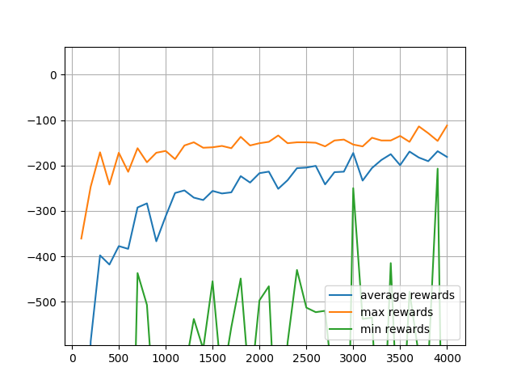
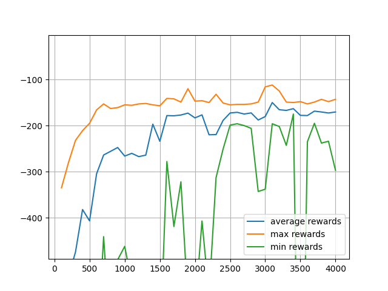
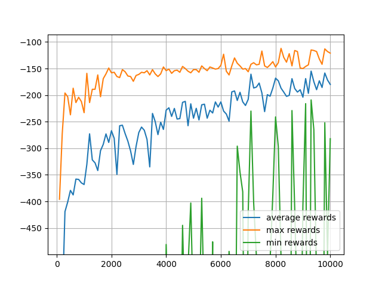
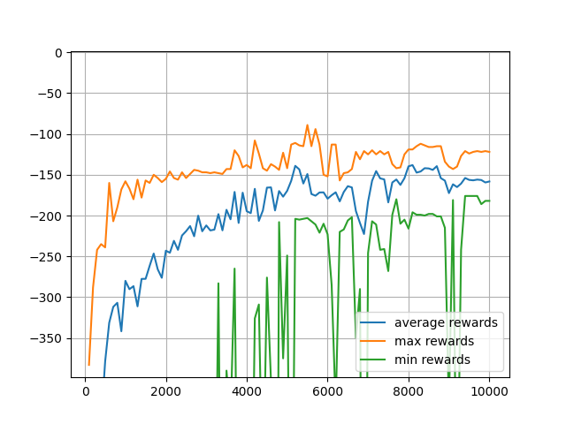
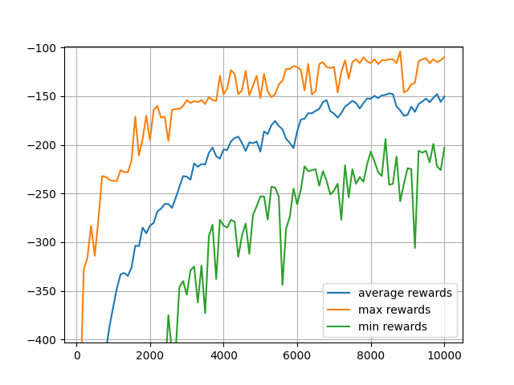
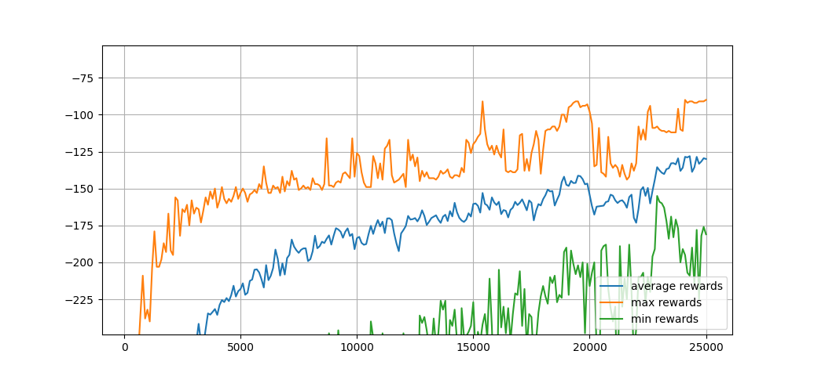

# Mountain Car Reinforcement Learning

This repository contains an implementation of a reinforcement learning algorithm to solve the Mountain Car problem. The goal is to train an agent to drive a car up a steep hill using reinforcement learning techniques.

## Overview

The Mountain Car problem is a classic reinforcement learning task where an underpowered car must drive up a steep hill. The car is positioned in a valley, and the agent needs to build up enough momentum to reach the goal at the top of the hill. The challenge lies in the fact that the car's engine is not powerful enough to directly drive up the hill; instead, the car must learn to leverage gravity by first driving away from the goal to build up speed.

## Installation

To get started with this project, follow these steps:

1. Clone this repository:
   ```sh
   git clone https://github.com/Sreeharij/Reinforcement-Learning.git
   cd Reinforcement-Learning

2. Install Dependencies:
   ```sh
   pip install -r requirements.txt
   cd mountain-car
3. Run the program:
   ```sh
   python mountain_car3_data_visualisation.py

## Analytics

1) Bucket Size = 20 Episodes = 4000 Decay_End = Full_Episodes
   


2) Bucket Size = 20 Episodes = 4000 Decay_End = Half_Episodes
   


3) Bucket Size = 20 Episodes = 10000 Decay_End = Full_Episodes
   


4) Bucket Size = 20 Episodes = 10000 Decay_End = Half_Episodes
   


5) Bucket Size = 40 Episodes = 10000 Decay_End = Full_Episodes



6) Bucket Size = 40 Episodes = 25000 Decay_End = Full_Episodes




## License

This project is licensed under the GNU General Public License v3.0. See the [LICENSE](LICENSE) file for details.

## Acknowledgements

- The implementation is based on the OpenAI Gym environment.

